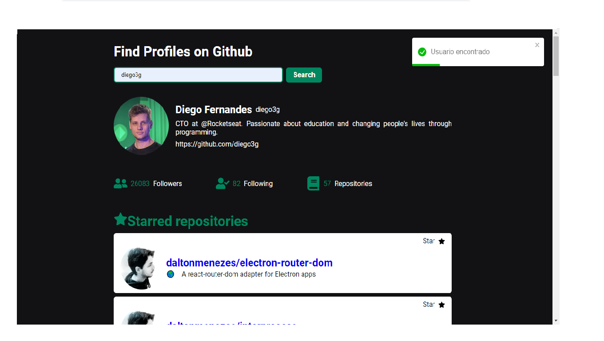

# Github-profile-search

Como iniciar o projeto?:

```bash
npm run dev
# or
yarn dev
```
<p align="center">
  
</p>

## 💻 Projeto

Esse projeto foi um teste de conhecimento para admição em vaga de desenvolvedor Front-end
